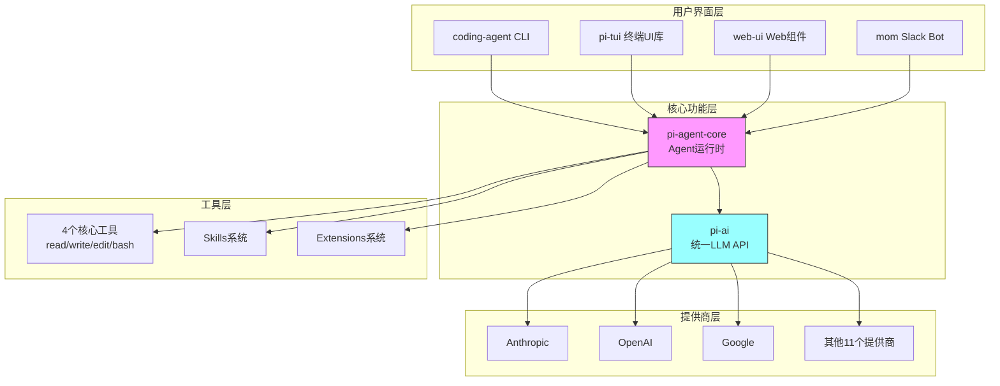
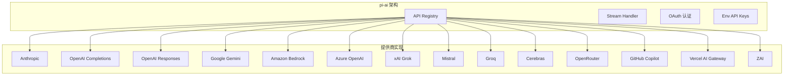
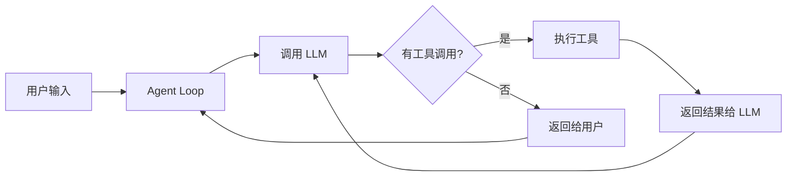
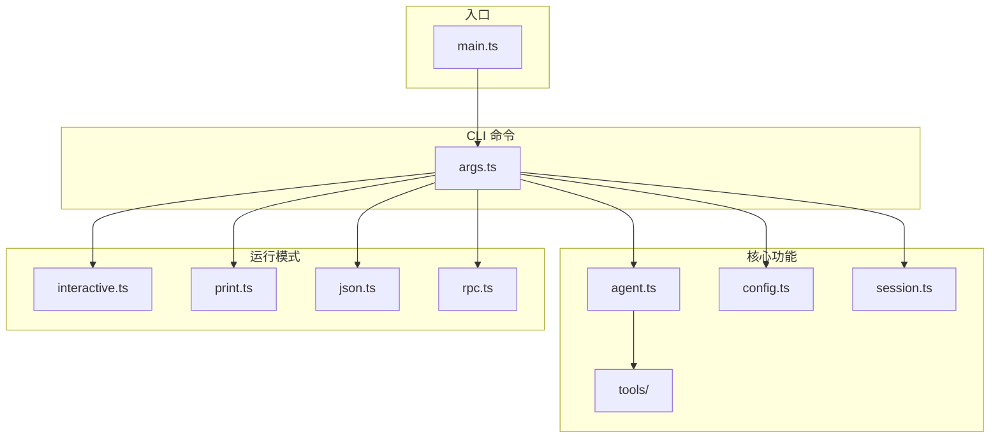
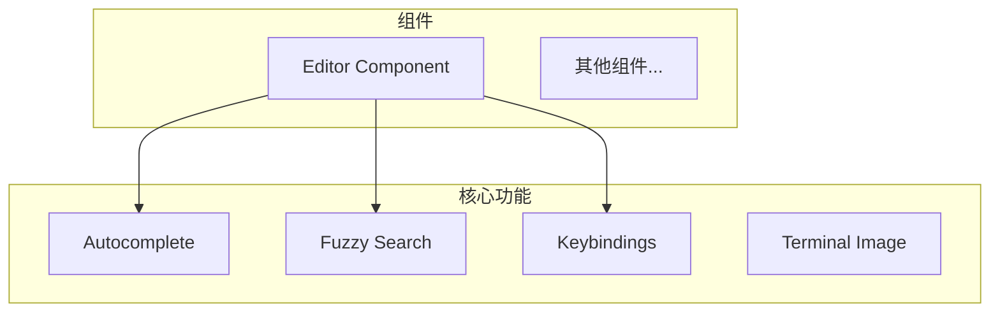
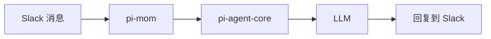
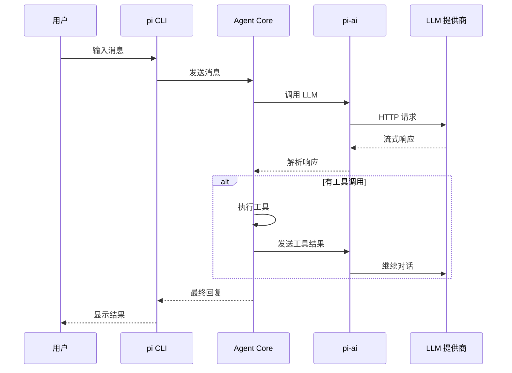

# pi-mono 项目架构分析

> 生成时间: 2026-03-21 (原始) / 2026-03-24 (整理)
> 分析目标: 理解 pi-mono 的架构，为对比 PoiClaw 做准备

---

## 📊 项目概览

**pi-mono** 是一个极简的、固执己见的 coding agent 框架，由 Mario Zechner 创建。

### 核心特点
- 🎯 **极简主义**: 只有 4 个核心工具（read, write, edit, bash）
- 🚀 **多提供商支持**: 支持 14 个 LLM 提供商
- 🛠️ **高度可定制**: Extensions, Skills, Prompt Templates, Themes
- 💻 **终端优先**: TUI（Terminal User Interface）交互
- 🔄 **会话管理**: 支持分支、压缩、恢复

---

## 🏗️ 整体架构图



---

## 📦 7 个核心包详解

### 1. **@mariozechner/pi-ai** - 统一 LLM API

**职责**: 提供统一的接口来调用不同的 LLM 提供商



**核心文件**:
```
src/
├── api-registry.ts          # API 注册表
├── stream.ts                # 流式响应处理
├── models.generated.ts      # 自动生成的模型列表
├── models.ts                # 模型类型定义
├── oauth.ts                 # OAuth 认证
├── env-api-keys.ts          # 环境变量 API 密钥
└── providers/               # 提供商实现
    ├── anthropic.ts
    ├── openai-completions.ts
    ├── openai-responses.ts
    ├── google.ts
    ├── amazon-bedrock.ts
    └── ... (14 个提供商)
```

**关键功能**:
- ✅ 统一接口: 一个 API 调用所有提供商
- ✅ 流式响应: 支持 SSE（Server-Sent Events）
- ✅ 工具调用: 所有提供商的工具调用统一处理
- ✅ 跨提供商上下文切换: 可以在对话中切换模型
- ✅ Token 和成本跟踪: 精确计算使用量

---

### 2. **@mariozechner/pi-agent-core** - Agent 运行时

**职责**: Agent 的核心循环和状态管理



**核心文件**:
```
src/
├── agent.ts         # Agent 类 (状态管理、事件订阅)
├── agent-loop.ts    # Agent 循环 (工具执行、消息处理)
├── proxy.ts         # 传输抽象 (直接/RPC 模式)
├── types.ts         # 类型定义
└── index.ts         # 导出
```

**关键功能**:
- ✅ **Agent 循环**: 处理用户消息 → 调用 LLM → 执行工具 → 返回结果
- ✅ **状态管理**: 管理会话状态、消息历史
- ✅ **消息队列**: 支持在 agent 工作时排队消息
- ✅ **传输抽象**: 支持直接运行或通过 RPC 代理
- ✅ **附件处理**: 支持图片、文档等附件
- ✅ **事件流**: 发射所有事件，便于构建响应式 UI

**传输抽象**:
```
传输抽象 = 让 Agent 可以选择：
  1. 直接和 LLM API 对话（fetch/sse）
  2. 通过 RPC 服务器转发（rpc）

只需换一个参数，其他代码不用动
```

---

### 3. **@mariozechner/pi-coding-agent** - 交互式 Coding Agent CLI

**职责**: 用户实际使用的命令行工具



**核心文件**:
```
src/
├── main.ts              # 入口点
├── cli/                 # CLI 命令处理
│   └── args.ts         # 命令行参数
├── core/                # 核心功能
│   ├── agent.ts        # Agent 实例化
│   ├── config.ts       # 配置管理
│   ├── session.ts      # 会话管理
│   └── tools/          # 工具定义
│       ├── read.ts
│       ├── write.ts
│       ├── edit.ts
│       └── bash.ts
├── modes/               # 运行模式
│   ├── interactive.ts  # 交互模式
│   ├── print.ts        # 打印模式
│   ├── json.ts         # JSON 模式
│   └── rpc.ts          # RPC 模式
└── utils/               # 工具函数
```

**关键功能**:
- ✅ **4 个核心工具**: read, write, edit, bash
- ✅ **会话管理**: 创建、恢复、分支会话
- ✅ **4 种运行模式**: 交互、打印、JSON、RPC
- ✅ **斜杠命令**: /login, /model, /theme 等
- ✅ **上下文文件**: 加载 AGENTS.md 等配置
- ✅ **自定义扩展**: Skills, Prompt Templates, Extensions

**系统提示词** (< 1000 tokens):
```
You are an expert coding assistant. You help users with coding tasks by
reading files, executing commands, editing code, and writing new files.

Available tools:
- read: Read file contents
- bash: Execute bash commands
- edit: Make surgical edits to files
- write: Create or overwrite files

Guidelines:
- Use bash for file operations like ls, grep, find
- Use read to examine files before editing
- Use edit for precise changes
- Use write only for new files or complete rewrites
```

---

### 4. **@mariozechner/pi-tui** - 终端 UI 库

**职责**: 提供终端用户界面框架



**关键功能**:
- ✅ **保留模式 UI**: 组件缓存渲染结果
- ✅ **差分渲染**: 只重绘变化的部分
- ✅ **同步输出**: 使用 CSI 序列防止闪烁
- ✅ **编辑器**: 支持模糊搜索、路径补全、拖放
- ✅ **键盘绑定**: 可自定义快捷键

**差分渲染原理**:
```
1. 首次渲染: 输出所有行到终端
2. 宽度改变: 清屏并重新渲染所有内容
3. 正常更新: 找到第一个不同的行，移动光标，从那里重新渲染
```

---

### 5. **@mariozechner/pi-mom** - Slack Bot

**职责**: Slack 集成，将消息委托给 pi coding agent



**核心文件**:
```
src/
├── main.ts         # 入口点
├── agent.ts        # Agent 配置
├── slack.ts        # Slack 集成
├── context.ts      # 上下文管理
├── events.ts       # 事件处理
├── log.ts          # 日志记录
├── store.ts        # 会话存储
├── tools/          # Slack 工具
└── download.ts     # 附件下载
```

---

### 6. **@mariozechner/pi-web-ui** - Web UI 组件

**职责**: 可重用的 Web UI 组件，用于构建基于 Web 的 AI 聊天界面

---

### 7. **@mariozechner/pi-pods** - GPU Pod 管理

**职责**: 管理 vLLM 在 GPU pod 上的部署，用于自托管 LLM 部署

---

## 🔄 数据流图



---

## 🎨 设计哲学总结

### 1. **极简工具集**
- 只保留 4 个核心工具: read, write, edit, bash
- 移除 80% 的工具反而提高准确率（Vercel 案例）

### 2. **极简系统提示词**
- < 1000 tokens vs Claude Code 的 10,000+ tokens
- 模型已经 RL 训练，理解 coding agent 概念

### 3. **YOLO 模式**
- 完全访问文件系统
- 可以执行任何命令
- 没有"安全剧场"（security theater）

### 4. **可观察性优先**
- 能看到 agent 的所有操作
- 不使用黑盒子 agent
- 基于文件的计划（PLAN.md）

### 5. **渐进式加载**
- 按需加载工具文档
- 不在会话开始时加载所有 MCP 工具
- 节省 token

---

## 📊 对比其他工具

| 特性 | pi | Claude Code | Cursor | Codex |
|------|-----|-------------|--------|-------|
| 工具数量 | 4 | 20+ | 15+ | 4 |
| 系统提示词 | <1k tokens | 10k+ tokens | 5k+ tokens | <1k tokens |
| 计划模式 | ❌ | ✅ | ✅ | ❌ |
| 子 Agent | ❌ (通过 bash) | ✅ | ✅ | ❌ |
| MCP 支持 | ❌ | ✅ | ❌ | ❌ |
| 后台 bash | ❌ (用 tmux) | ✅ | ✅ | ❌ |
| 可观察性 | ⭐⭐⭐⭐⭐ | ⭐⭐ | ⭐⭐ | ⭐⭐⭐⭐ |

---

## 🚀 架构亮点

### 1. 传输抽象 (Proxy)
```
传输抽象 = 让 Agent 可以选择：
  1. 直接和 LLM API 对话（fetch/sse）
  2. 通过 RPC 服务器转发（rpc）

只需换一个参数，其他代码不用动
```

**好处**:
- ✅ 灵活切换部署方式
- ✅ 代码复用
- ✅ 易于测试

### 2. 提供商抽象
一个统一的 API 调用 14 个不同的 LLM 提供商，支持:
- 流式响应
- 工具调用
- Token 跟踪
- 成本计算

### 3. TUI 差分渲染
保留模式 + 差分渲染:
- 首次渲染输出所有内容
- 后续只更新变化的部分
- 使用 CSI 序列移动光标

---

## 📚 参考资料

- [Mario 的博客文章](https://mariozechner.at/posts/2025-11-30-pi-coding-agent/)
- [pi-mono GitHub](https://github.com/badlogic/pi-mono)
- [pi-coding-agent README](../pi-mono/packages/coding-agent/README.md)
- [AGENTS.md](../pi-mono/AGENTS.md) (开发规则)

---

**生成者**: Claude AI
**分析日期**: 2026-03-21
**整理日期**: 2026-03-24
