# PoiClaw vs pi-mono 架构对比分析

> 生成时间: 2026-03-24
> 分析目标: 深入对比两个框架的联系与区别

---

## 概述对比

| 维度 | PoiClaw | pi-mono |
|------|---------|---------|
| **语言** | Python 3.12+ | TypeScript/Node.js |
| **核心理念** | 极简、透明、可控 | 极简、固执己见 |
| **工具数量** | 6 核心工具 + 扩展 | 4 核心工具 |
| **LLM 支持** | OpenAI 兼容 API | 14 个提供商原生支持 |
| **安全模式** | 三层安全（可选） | YOLO 模式（无限制） |
| **事件系统** | 10 种事件 | 事件流（未分类） |
| **会话管理** | 分离存储 | 单文件存储 |
| **多智能体** | SubagentTool (内置) | 通过 bash 实现 |
| **UI 层** | CLI + 飞书 | CLI + TUI + Web + Slack |

---

## 架构联系

### 1. 共同的设计理念

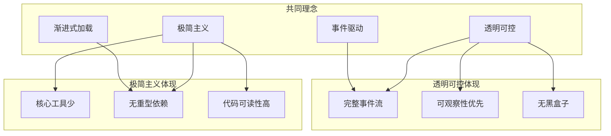

**共同点**:
1. **极简工具集**: PoiClaw 6 个 vs pi-mono 4 个
2. **不依赖重型框架**: PoiClaw 不用 LangChain，pi-mono 不用 LangChain
3. **事件驱动**: 都提供完整的事件流
4. **渐进式加载**: 都支持按需加载工具/技能详情

---

### 2. 相似的模块划分

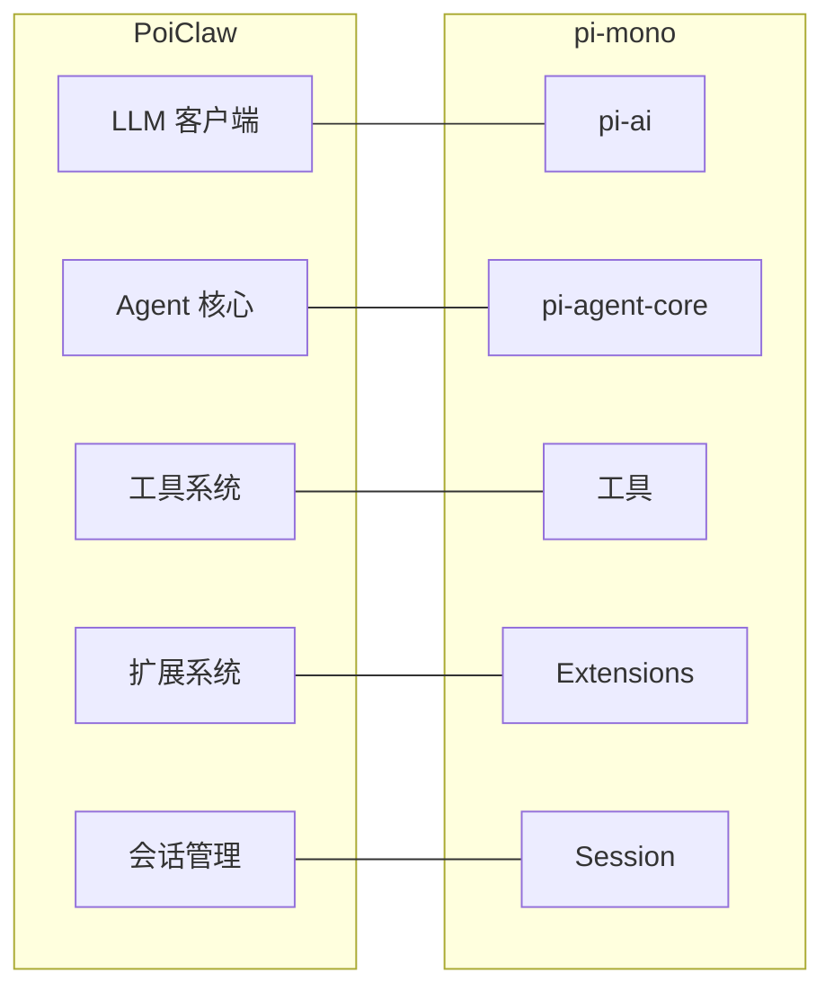

---

### 3. 相似的核心流程

两者都采用 **ReAct 循环**:

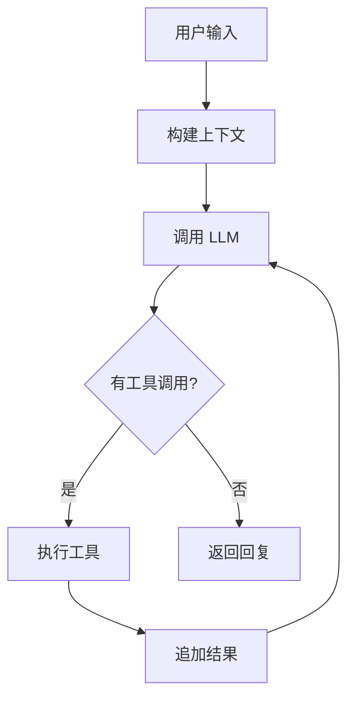

---

## 架构区别

### 1. 安全哲学

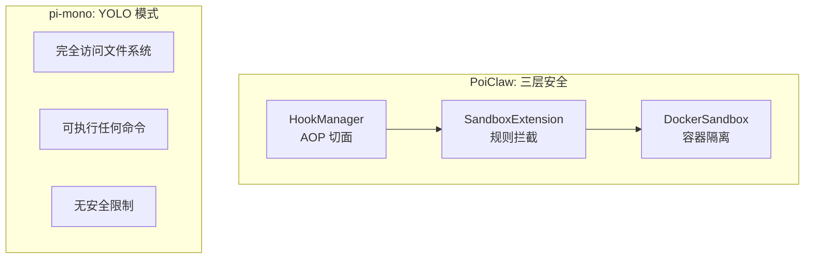

| 安全层面 | PoiClaw | pi-mono |
|---------|---------|---------|
| **默认模式** | 安全沙箱（可配置） | YOLO（无限制） |
| **命令拦截** | ✅ 正则匹配危险命令 | ❌ 无 |
| **容器隔离** | ✅ Docker 沙箱可选 | ❌ 无 |
| **钩子系统** | ✅ 责任链模式 | ❌ 无 |

**设计哲学差异**:
- **PoiClaw**: "安全优先" - 默认拦截危险操作，适合生产环境
- **pi-mono**: "信任用户" - YOLO 模式，适合个人开发者

---

### 2. 多智能体协作

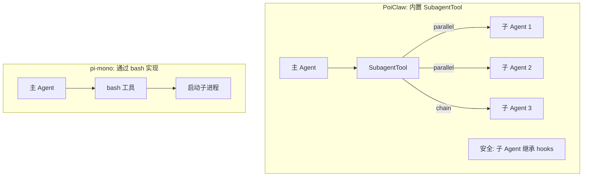

| 特性 | PoiClaw | pi-mono |
|------|---------|---------|
| **实现方式** | 内置 SubagentTool | 通过 bash 启动子进程 |
| **执行模式** | single / parallel / chain | 无原生支持 |
| **安全继承** | ✅ 子 Agent 必须继承 hooks | ❌ 无 |
| **上下文隔离** | ✅ 独立 messages | 需手动管理 |

---

### 3. 事件系统

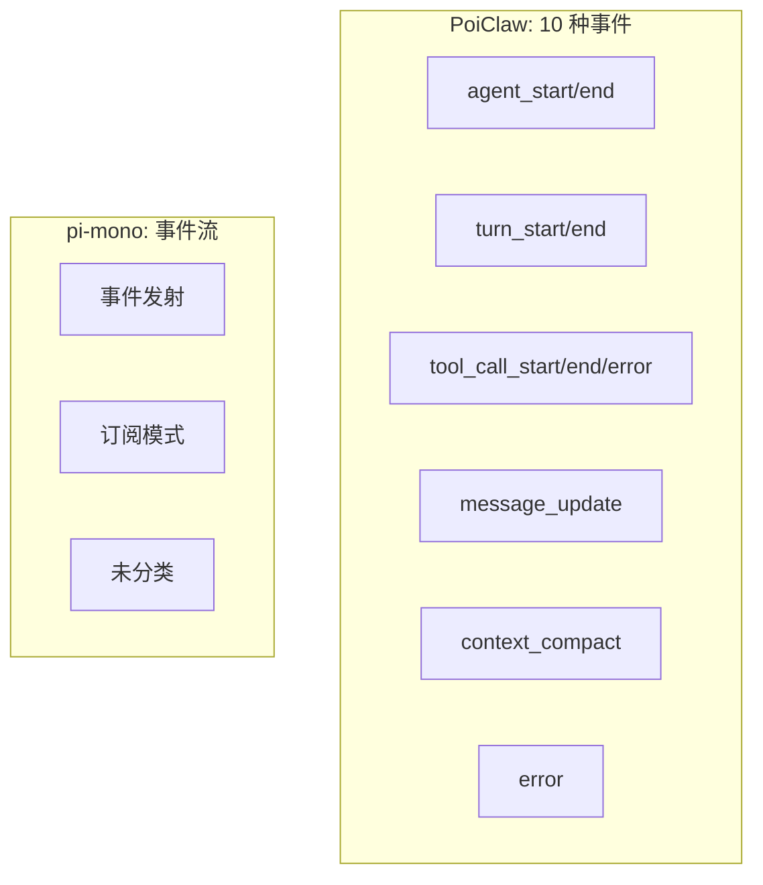

| 特性 | PoiClaw | pi-mono |
|------|---------|---------|
| **事件类型** | 10 种明确分类 | 事件流（通用） |
| **Turn 粒度** | ✅ turn_start/end | ❌ 无 |
| **压缩事件** | ✅ context_compact | ❌ 无 |
| **工具事件** | ✅ start/end/error 三阶段 | ✅ 基础事件 |

---

### 4. 会话管理

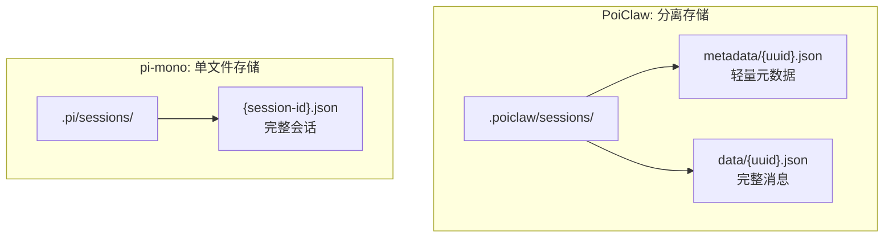

| 特性 | PoiClaw | pi-mono |
|------|---------|---------|
| **存储结构** | 分离存储（metadata + data） | 单文件 |
| **列表性能** | ✅ 只读 metadata | 需读取完整文件 |
| **压缩历史** | ✅ CompactionEntry 列表 | ❌ 无 |
| **Token 统计** | ✅ UsageStats 累积 | ✅ 支持 |

---

### 5. LLM 提供商支持

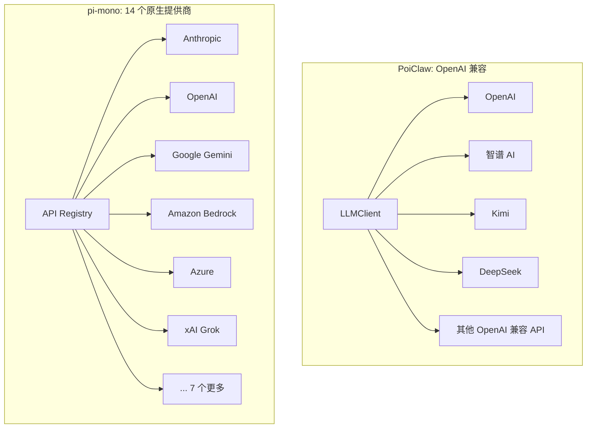

| 特性 | PoiClaw | pi-mono |
|------|---------|---------|
| **提供商数量** | 所有 OpenAI 兼容 API | 14 个原生支持 |
| **统一接口** | ✅ | ✅ |
| **流式响应** | ✅ SSE | ✅ SSE |
| **工具调用** | ✅ Function Calling | ✅ Function Calling |
| **跨提供商切换** | ❌ 需重启 | ✅ 对话中切换 |
| **OAuth 认证** | ❌ | ✅ |

---

### 6. 系统提示词

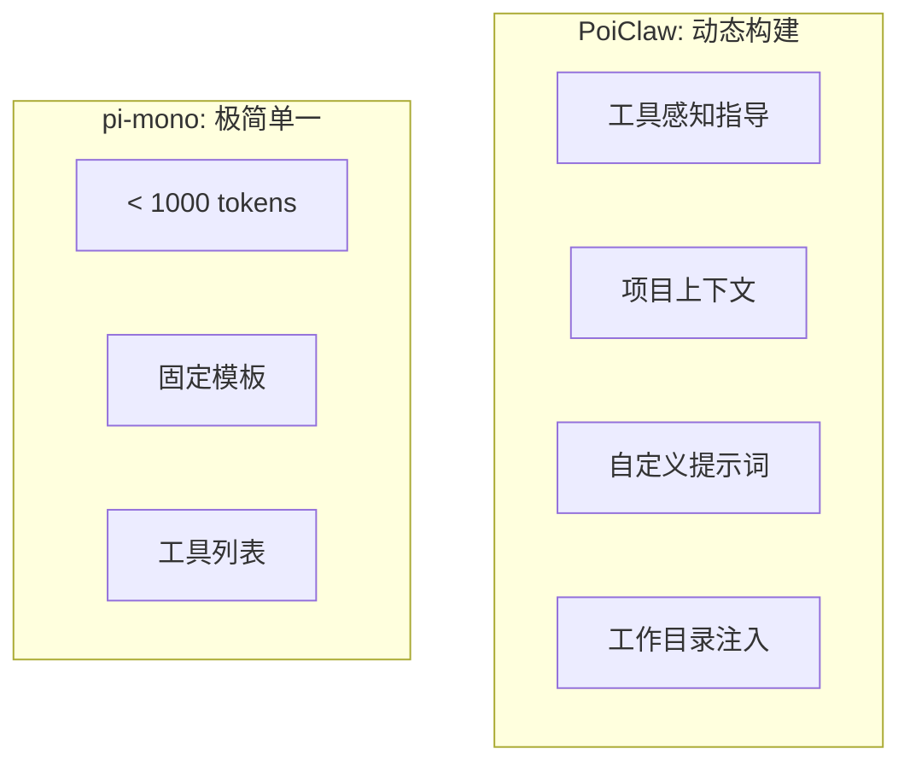

| 特性 | PoiClaw | pi-mono |
|------|---------|---------|
| **Token 大小** | 动态（可配置） | < 1000 tokens |
| **工具感知** | ✅ 根据工具自动生成指导 | ✅ 基础指导 |
| **项目上下文** | ✅ CLAUDE.md 自动加载 | ✅ AGENTS.md |
| **自定义提示词** | ✅ 完全替换 | ✅ Prompt Templates |

---

### 7. UI 层

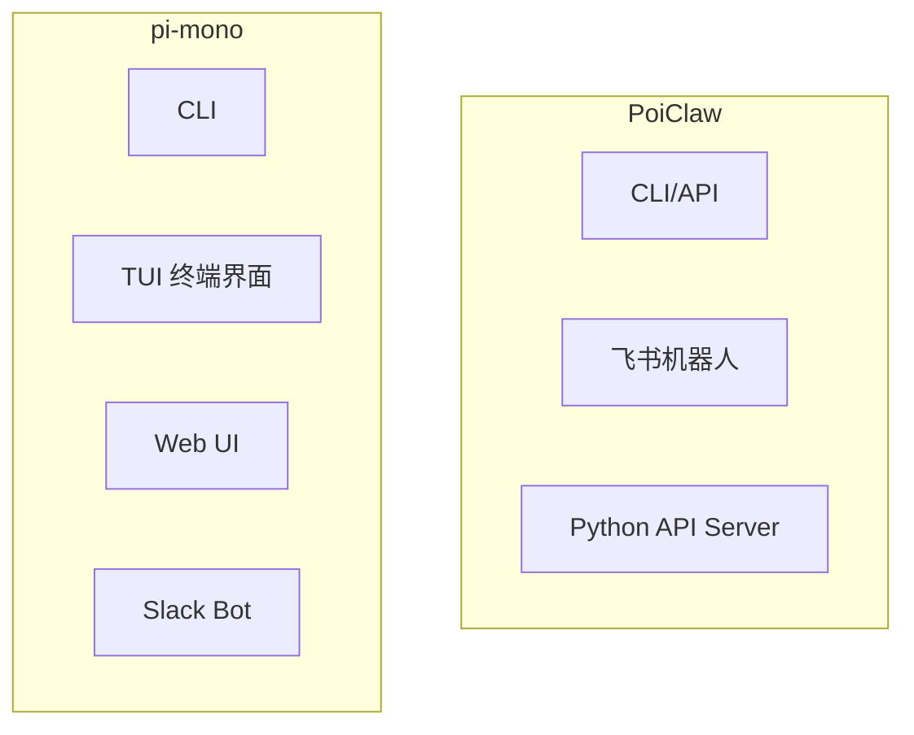

| 特性 | PoiClaw | pi-mono |
|------|---------|---------|
| **终端 UI** | ❌ | ✅ pi-tui（差分渲染） |
| **Web UI** | ❌ | ✅ web-ui 组件 |
| **IM 集成** | ✅ 飞书 | ✅ Slack |
| **API Server** | ✅ | ✅ RPC 模式 |

---

### 8. 扩展系统

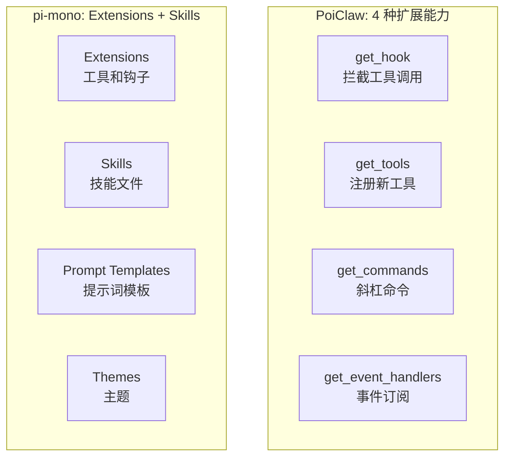

| 特性 | PoiClaw | pi-mono |
|------|---------|---------|
| **AOP 钩子** | ✅ get_hook() | ✅ 类似机制 |
| **工具注册** | ✅ get_tools() | ✅ |
| **斜杠命令** | ✅ get_commands() | ✅ |
| **事件订阅** | ✅ get_event_handlers() | ✅ |
| **技能文件** | ✅ Skills (Markdown) | ✅ SKILL.md |
| **提示词模板** | ❌ | ✅ Prompt Templates |
| **主题系统** | ❌ | ✅ Themes |

---

## 代码风格对比

### PoiClaw (Python)

```python
# 数据类风格
@dataclass
class AgentStartEvent:
    type: EventType = field(default=EventType.AGENT_START, init=False)
    timestamp: str = field(default_factory=lambda: datetime.now().isoformat())
    agent_id: str | None = None
    user_input: str | None = None

# 异步优先
async def run(self, user_input: str) -> str:
    # ...

# 类型提示
def get_tool_schema(self, name: str) -> dict[str, Any] | None:
    # ...
```

### pi-mono (TypeScript)

```typescript
// 接口风格
interface AgentStartEvent {
    type: 'agent_start';
    timestamp: string;
    agentId?: string;
    userInput?: string;
}

// 异步优先
async run(userInput: string): Promise<string> {
    // ...
}

// 类型定义
getToolSchema(name: string): Record<string, any> | undefined {
    // ...
}
```

---

## 适用场景对比

### PoiClaw 更适合

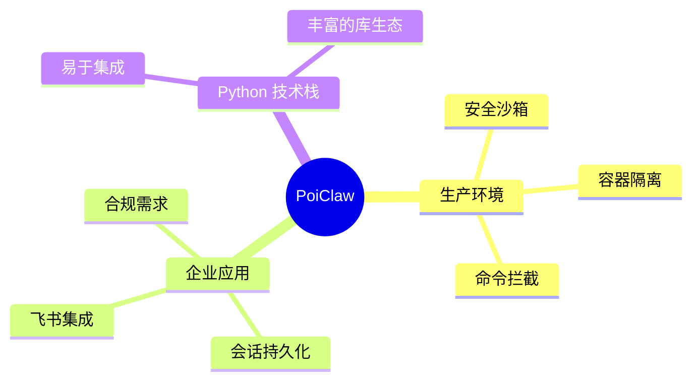

**场景**:
1. **生产环境部署** - 需要安全控制的场景
2. **企业内部应用** - 飞书集成、会话管理
3. **Python 技术栈** - 与现有 Python 项目集成
4. **需要多智能体协作** - SubagentTool 内置支持
5. **合规要求** - Docker 沙箱隔离

### pi-mono 更适合

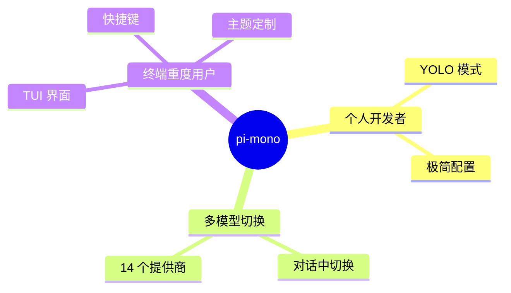

**场景**:
1. **个人开发者** - YOLO 模式，无限制
2. **多模型实验** - 14 个提供商，对话中切换
3. **终端重度用户** - TUI 界面，快捷键
4. **TypeScript/Node.js 技术栈** - 与现有项目集成
5. **需要 Web UI** - 内置 web-ui 组件

---

## 学习路径建议

### 从 pi-mono 学习

1. **极简主义**: 工具越少，准确率越高
2. **传输抽象**: 直接/RPC 模式切换
3. **提供商抽象**: 统一 API 调用多个提供商
4. **TUI 差分渲染**: 高性能终端 UI

### PoiClaw 的创新

1. **三层安全**: Hooks + Sandbox + Docker
2. **SubagentTool**: 内置多智能体协作
3. **10 种事件**: 完整的生命周期事件
4. **分离存储**: metadata + data 分离
5. **上下文压缩**: LLM 摘要 + 智能切割

---

## 功能对照表

| 功能 | PoiClaw | pi-mono |
|------|---------|---------|
| **ReAct 循环** | ✅ | ✅ |
| **流式响应** | ✅ | ✅ |
| **工具调用** | ✅ | ✅ |
| **会话管理** | ✅ 分离存储 | ✅ 单文件 |
| **上下文压缩** | ✅ LLM 摘要 | ✅ |
| **事件系统** | ✅ 10 种事件 | ✅ 事件流 |
| **安全钩子** | ✅ 责任链 | ❌ |
| **Docker 沙箱** | ✅ | ❌ |
| **多智能体** | ✅ SubagentTool | ❌ 通过 bash |
| **Skills 系统** | ✅ Markdown | ✅ SKILL.md |
| **渐进式加载** | ✅ | ✅ |
| **TUI 界面** | ❌ | ✅ pi-tui |
| **Web UI** | ❌ | ✅ web-ui |
| **飞书集成** | ✅ | ❌ |
| **Slack 集成** | ❌ | ✅ mom |
| **14 个提供商** | ❌ | ✅ |
| **OAuth 认证** | ❌ | ✅ |
| **斜杠命令** | ✅ | ✅ |
| **主题系统** | ❌ | ✅ |
| **提示词模板** | ❌ | ✅ |

---

## 总结

### 核心差异

1. **安全哲学**: PoiClaw 默认安全，pi-mono 默认 YOLO
2. **多智能体**: PoiClaw 内置支持，pi-mono 通过 bash
3. **提供商**: PoiClaw OpenAI 兼容，pi-mono 14 个原生
4. **UI 层**: PoiClaw 侧重 API，pi-mono 侧重 TUI

### 互补学习

- **pi-mono** 教会我们极简主义和传输抽象
- **PoiClaw** 展示了安全设计和多智能体协作

### 选择建议

- **个人开发/实验** → pi-mono（YOLO 模式，多模型）
- **企业应用/生产** → PoiClaw（安全沙箱，飞书集成）
- **Python 技术栈** → PoiClaw
- **TypeScript 技术栈** → pi-mono

---

**生成者**: Claude AI
**分析日期**: 2026-03-24
