# PoiClaw 项目架构分析

> 生成时间: 2026-03-24
> 分析目标: 深入理解 PoiClaw 的架构设计

---

## 项目概览

**PoiClaw** 是一个极简、透明的 Python Coding Agent 框架，核心理念是**极简、透明、可控**。不依赖 LangChain 等重型框架，每一行代码都清晰可读。

### 核心特点
- 🎯 **极简主义**: 6 个核心工具 + 可选扩展
- 🔒 **安全优先**: 多层安全机制（Hooks + Sandbox + Docker）
- 📡 **完整事件流**: 10 种事件类型覆盖全生命周期
- 💾 **会话持久化**: 分离存储 + 断点续传
- 🤝 **多智能体协作**: Tool-based Fork-Join 模式
- 🧠 **上下文压缩**: LLM 摘要压缩 + 智能切割

---

## 整体架构图

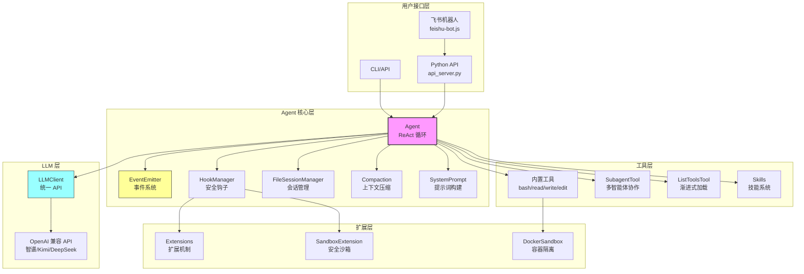

---

## 核心模块详解

### 1. Agent 核心 (core/agent.py)

**职责**: ReAct 循环的完整实现

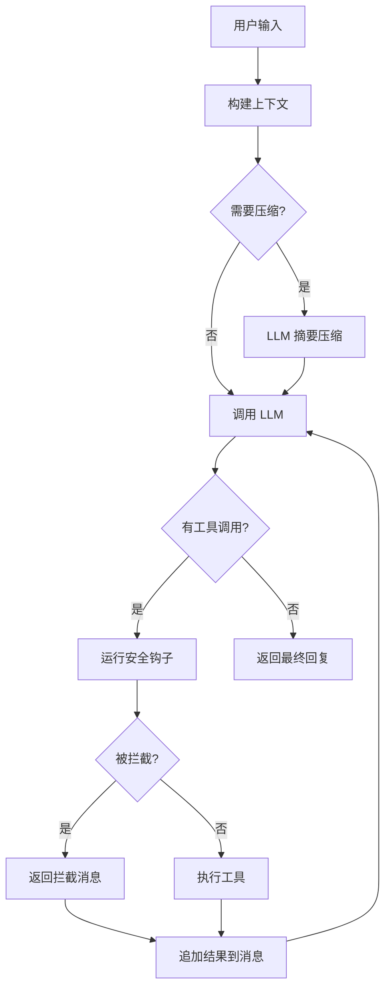

**关键特性**:
- ✅ **渐进式工具加载**: `progressive_tools=True` 时只注入工具简介
- ✅ **自动上下文压缩**: 超过阈值时自动触发 LLM 摘要
- ✅ **事件发射**: 每个关键节点发射事件
- ✅ **会话持久化**: 每轮循环后自动保存

---

### 2. 事件系统 (core/events.py)

**职责**: 提供完整的事件流，支持订阅/发射模式

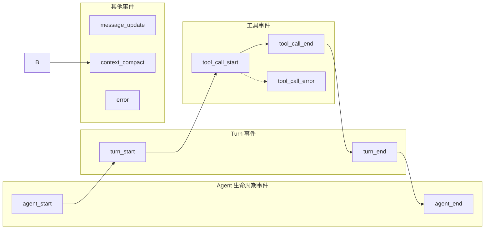

**10 种事件类型**:

| 事件 | 触发时机 | 关键数据 |
|------|---------|---------|
| `agent_start` | Agent 开始运行 | user_input, config |
| `agent_end` | Agent 运行结束 | final_response, state, error |
| `turn_start` | 回合开始 | turn_number |
| `turn_end` | 回合结束 | llm_response, tool_calls_made |
| `message_update` | 消息添加到上下文 | role, content_preview |
| `tool_call_start` | 工具调用开始 | tool_name, arguments |
| `tool_call_end` | 工具调用结束 | success, result_preview, duration_ms |
| `tool_call_error` | 工具调用错误 | error_type, error_message |
| `context_compact` | 上下文压缩 | tokens_before, tokens_after |
| `error` | Agent 运行错误 | error_type, error_message |

---

### 3. 安全钩子系统 (core/hooks.py)

**职责**: AOP 切面，在工具执行前拦截

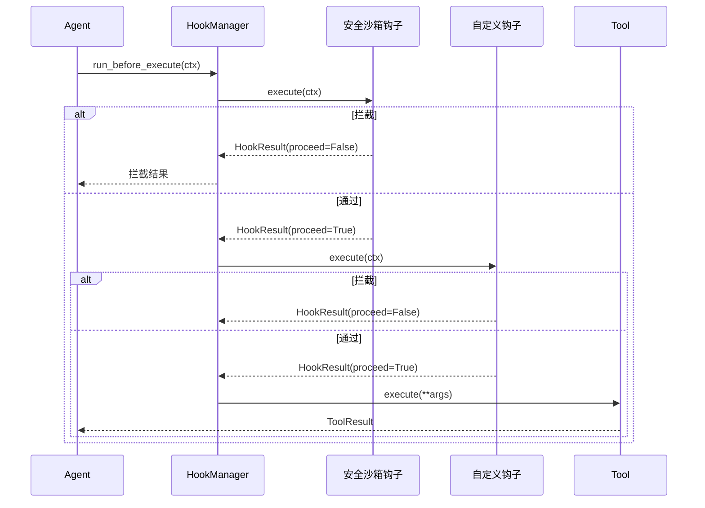

**责任链模式**: 多个钩子按顺序执行，任一返回 `proceed=False` 即终止

---

### 4. 会话管理 (core/session.py)

**职责**: 分离存储方案的会话持久化

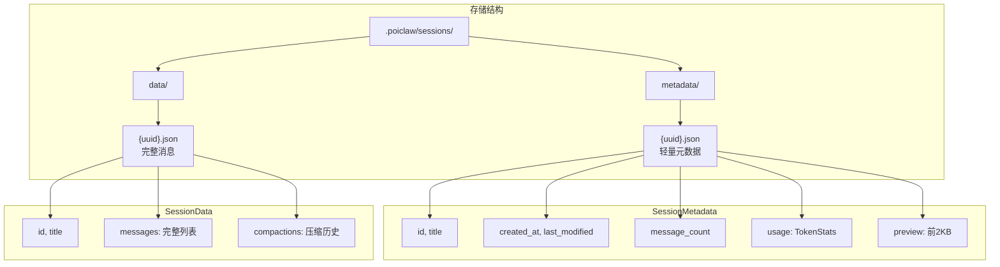

**关键特性**:
- ✅ **分离存储**: metadata 用于列表展示，data 存储完整数据
- ✅ **标题保护**: `title=None` 时保留原标题
- ✅ **内存保护**: 只在 messages 为空时加载历史
- ✅ **异步 I/O**: 使用 `asyncio.to_thread` 包装文件操作

---

### 5. 上下文压缩 (core/compaction.py)

**职责**: LLM 摘要压缩，智能切割点查找

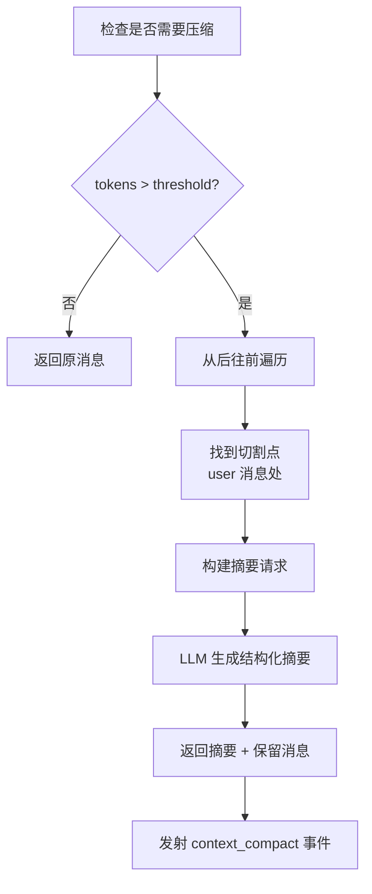

**压缩流程**:
1. 估算当前 token 数（`len(text) // 4`）
2. 如果超过 `context_window - reserve_tokens`，触发压缩
3. 从后往前遍历，在 user 消息处切割（保持 Turn 完整性）
4. 调用 LLM 生成结构化摘要（目标、进度、决策、下一步）
5. 替换压缩部分为摘要

---

### 6. 系统提示词构建 (core/system_prompt.py)

**职责**: 动态构建系统提示词

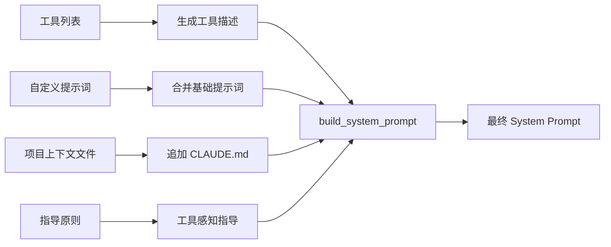

**工具感知指导**:
- 如果有 `bash` 但没有 `grep`/`find` → "使用 bash 进行文件操作"
- 如果有 `read` + `edit` → "编辑前先使用 read 查看文件内容"
- 如果有 `subagent` → "复杂任务可以使用 subagent 创建子 Agent"

---

### 7. 工具系统

#### 7.1 BaseTool 抽象类

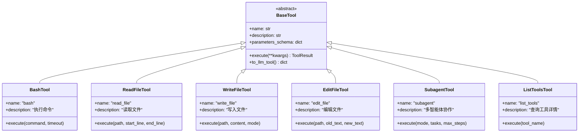

#### 7.2 ToolRegistry

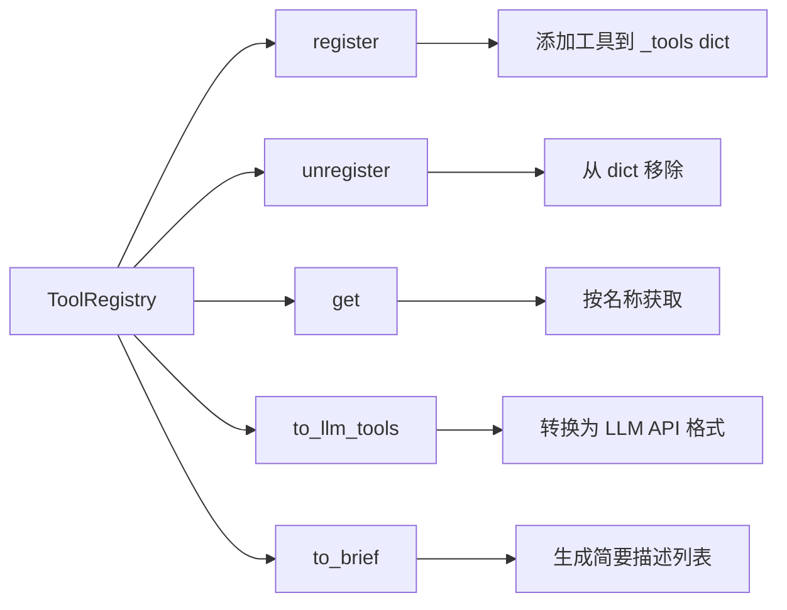

---

### 8. SubagentTool 多智能体协作

**职责**: Tool-based Fork-Join 模式

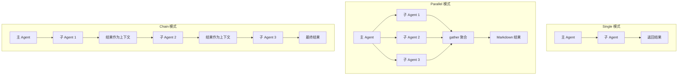

**安全设计**:
- 子 Agent **必须**继承 hooks，确保安全沙箱规则生效
- 子 Agent 拥有独立的 messages 上下文，不污染主 Agent

---

### 9. 扩展系统 (extensions/)

**职责**: 提供可插拔的扩展能力

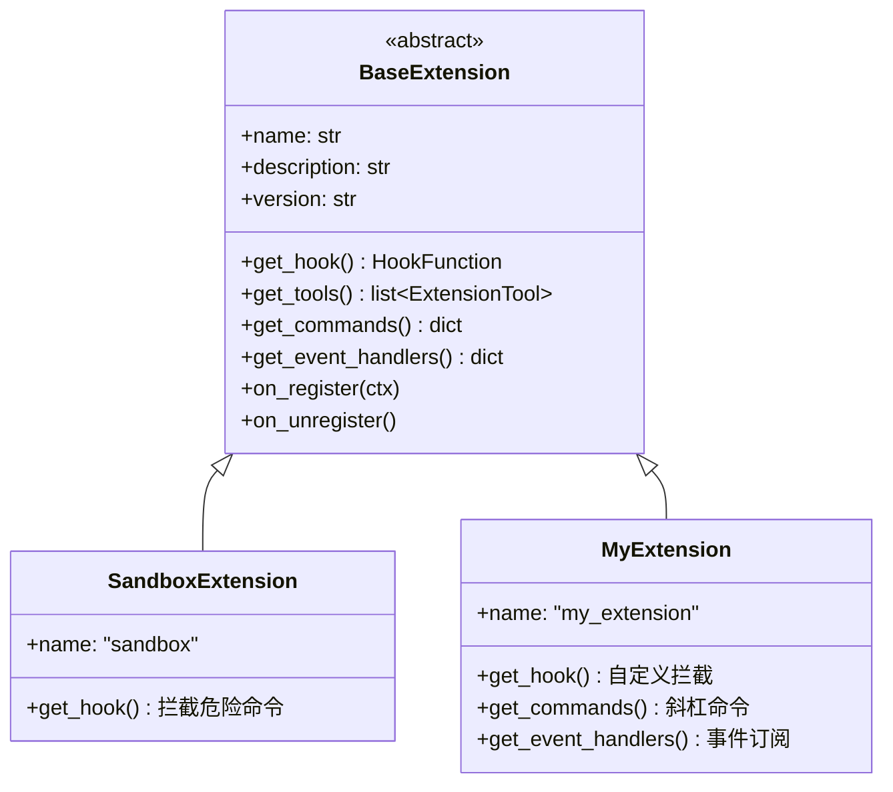

**4 种扩展能力**:
1. `get_hook()` - 拦截工具调用（AOP 切面）
2. `get_tools()` - 注册新工具
3. `get_commands()` - 注册斜杠命令
4. `get_event_handlers()` - 订阅 Agent 事件

---

### 10. Docker 沙箱 (sandbox/docker_manager.py)

**职责**: 容器隔离执行命令

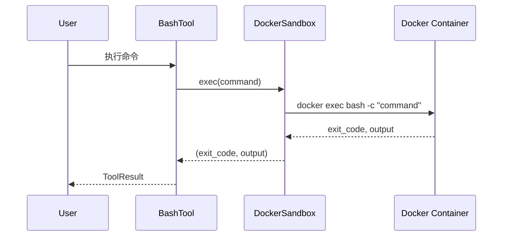

**关键特性**:
- ✅ **工作目录挂载**: 项目目录自动挂载到 `/workspace`
- ✅ **生命周期管理**: `start()` / `stop()` / `remove()`
- ✅ **超时控制**: 支持命令执行超时
- ✅ **流式输出**: `exec_with_stream()` 实时输出

---

### 11. Skills 系统 (skills/)

**职责**: 渐进式技能加载

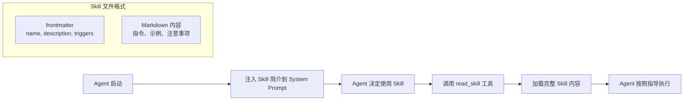

**Token 节省**: 初始只注入简介（~50 tokens），按需加载完整内容（~500 tokens）

---

### 12. LLM 客户端 (llm/client.py)

**职责**: 统一的 LLM API 调用

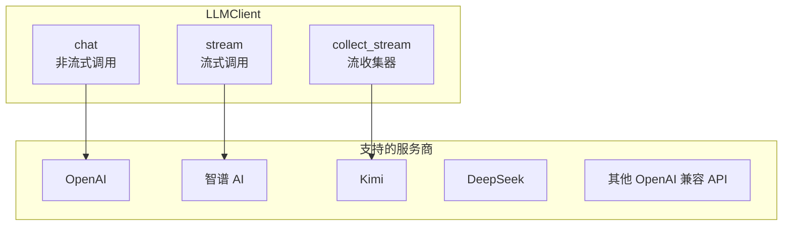

**关键特性**:
- ✅ **统一接口**: 一个 API 调用所有服务商
- ✅ **流式响应**: SSE（Server-Sent Events）
- ✅ **工具调用**: Function Calling
- ✅ **全异步**: async/await
- ✅ **强类型**: Pydantic

---

## 数据流图

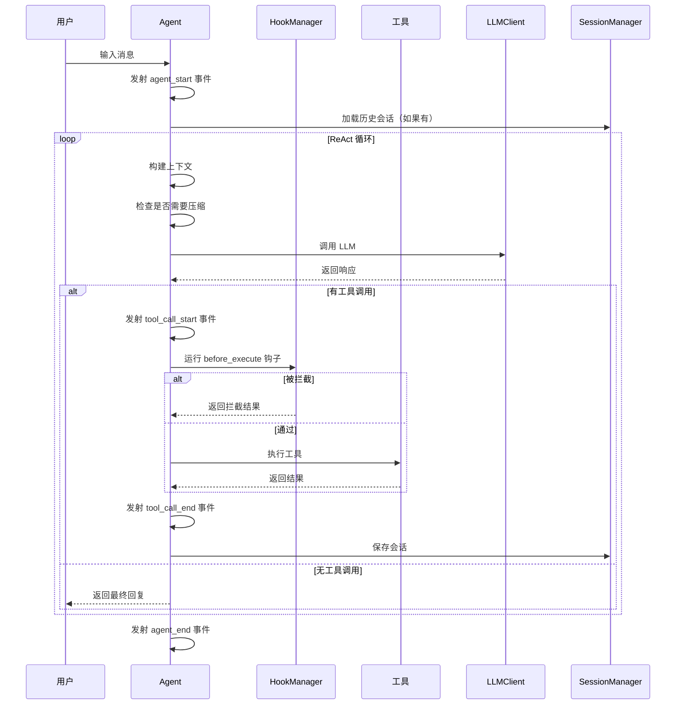

---

## 设计哲学

### 1. 极简主义
- 核心只有 6 个工具
- 不依赖 LangChain 等重型框架
- 每行代码清晰可读

### 2. 安全优先
- **三层安全**: Hooks → SandboxExtension → DockerSandbox
- **责任链模式**: 多个钩子按顺序拦截
- **强制继承**: 子 Agent 必须继承安全钩子

### 3. 事件驱动
- 完整的生命周期事件
- 并发执行处理器
- 易于构建响应式 UI

### 4. 可扩展性
- BaseExtension 抽象基类
- 4 种扩展能力（钩子、工具、命令、事件）
- Skills 系统支持自定义技能

### 5. 渐进式加载
- 工具按需查询（`list_tools`）
- 技能按需加载（`read_skill`）
- 大幅节省 Token

---

## 项目结构

```
PoiClaw/
├── src/poiclaw/
│   ├── llm/                    # LLM 调用层
│   │   ├── client.py           # 统一 API 客户端
│   │   ├── stream.py           # SSE 流式解析
│   │   ├── types.py            # Pydantic 类型
│   │   └── exceptions.py       # 自定义异常
│   ├── core/                   # Agent 核心层
│   │   ├── agent.py            # ReAct 循环
│   │   ├── events.py           # 事件系统
│   │   ├── tools.py            # BaseTool + ToolRegistry
│   │   ├── hooks.py            # 安全钩子
│   │   ├── session.py          # 会话管理
│   │   ├── compaction.py       # 上下文压缩
│   │   └── system_prompt.py    # 系统提示词构建
│   ├── tools/                  # 内置工具
│   │   ├── bash.py             # BashTool
│   │   ├── read_file.py        # ReadFileTool
│   │   ├── write_file.py       # WriteFileTool
│   │   ├── edit_file.py        # EditFileTool
│   │   ├── subagent.py         # SubagentTool
│   │   ├── list_tools.py       # ListToolsTool
│   │   └── read_skill.py       # ReadSkillTool
│   ├── extensions/             # 扩展系统
│   │   ├── base.py             # BaseExtension
│   │   ├── manager.py          # ExtensionManager
│   │   └── sandbox.py          # SandboxExtension
│   ├── skills/                 # Skills 系统
│   │   ├── models.py           # Skill 数据模型
│   │   ├── loader.py           # Skill 加载器
│   │   └── registry.py         # Skill 注册表
│   ├── sandbox/                # Docker 沙箱
│   │   └── docker_manager.py   # DockerSandbox
│   └── server/                 # IM 接入
│       └── feishu.py           # 飞书机器人
├── skills/                     # 技能定义
│   ├── commit.md
│   ├── review-pr.md
│   └── test-runner.md
└── tests/                      # 测试文件
```

---

**生成者**: Claude AI
**分析日期**: 2026-03-24
